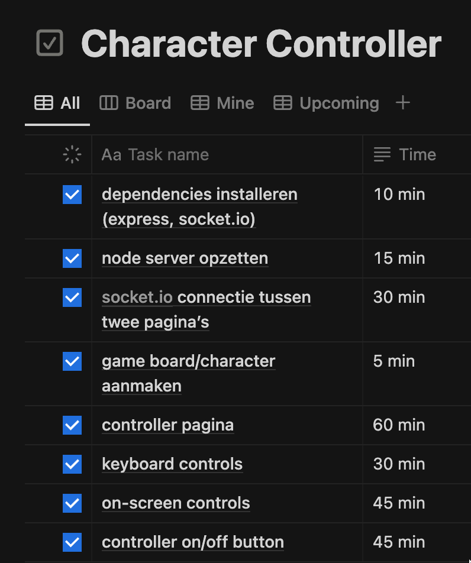

# Character Controller

### Todo


### Sprint retrospective week 2

Wat goed ging:

- Ik heb een goed functionerende character controller kunnen implementeren
- De belangrijkste features zijn toegevoegd

Wat minder goed ging:

- Ik had moeite met het inschatten van de tijd die nodig was voor de verschillende todo's, waardoor ik soms meer tijd nodig had dan gepland
- Er was een movement bug die mij een hele dag heeft gekost om op te lossen. Dit heeft ervoor gezorgd dat ik niet meer features heb kunnen toepassen dan ik had gewild (bijvoorbeeld een werkende border en tekst input)

Verbeterpunten:

- Beter de tijd inschatten die nodig is voor de verschillende taken. Dit kan door bijvoorbeeld een ruime tijd inplannen die nodig zou kunnen zijn om bugs op te lossen.

### To run the project locally

Clone the project

```bash
  git clone https://github.com/smschijf/character-controller
```

Install dependencies

```bash
  npm install
```

Start the server

```bash
  node app.js
```
